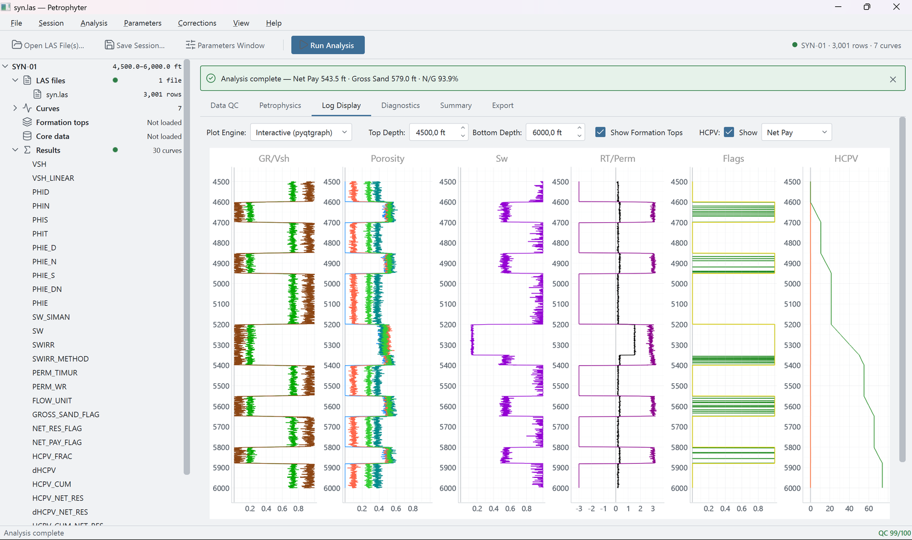

# Petrophyter

**Desktop Petrophysics Application** — A comprehensive tool for well-log analysis and petrophysical calculations.


-orange.svg)



## Overview

Petrophyter is a PyQt6 desktop application for loading, analyzing, visualizing, and exporting petrophysical well-log data.

Key capabilities include:

- LAS loading, automatic curve mapping, and intelligent multi-file merging
- Multi-well projects: run every well in one click, with parameters set per project, well, and formation zone (including a, m, n, Rw, and Rsh)
- Shale-volume, porosity, water-saturation, Swirr, and permeability calculations
- Archie, Indonesian, Simandoux, Waxman-Smits, and Dual-Water saturation models
- Core-calibrated permeability and statistical core-data validation
- HCPV and configurable net-pay analysis
- Formation-top overlays and quality-control diagnostics
- Interactive GPU-accelerated six-track log visualization
- Excel, CSV, and LAS export, per well or for all wells with a field summary
- JSON session save and load of the whole multi-well project
- Light and Dark application themes

## Quick Start

### Windows installer

Download the latest `Petrophyter_Setup_*.exe` from [Releases](https://github.com/rcrohmana/petrophyter/releases/latest), run it, and launch **Petrophyter** from the Start Menu.

### Run from source

Requires Python 3.10 or higher.

```bash
pip install -r requirements.txt
python main.py
```

On the development machine, double-click `run_petrophyter.bat` in the repository root. It launches the app in the `mldl` Conda environment.

See [Installation](docs/installation.md) for dependency versions and complete setup information.

## Basic Workflow

1. **Load data:** Use **File → Open LAS File(s)…** (`Ctrl+O`). Select several files to load several wells at once, or to merge files from the same well.
2. **Configure:** In the Parameters window (`Ctrl+P`), select calculation methods and adjust shale, matrix, fluid, and cutoff parameters.
3. **Analyze:** Run the petrophysical calculations (`F5`), or every well at once (`Ctrl+Shift+R`).
4. **Review:** Inspect logs, crossplots, diagnostics, core validation, and net-pay results.
5. **Export:** Save the results or session for later use.

See the [User Guide](docs/user-guide.md) for multi-LAS merging, core validation, session handling, and keyboard shortcuts.

## Documentation

Documentation is organized by topic so every reader can access technical and operational details directly.

| Topic | Contents |
|---|---|
| [Installation](docs/installation.md) | Prerequisites, setup, and dependency versions |
| [User Guide](docs/user-guide.md) | Data-loading and analysis workflows, core validation, and shortcuts |
| [Supported Data Formats](docs/data-formats.md) | LAS support and complete core/formation column requirements |
| [Calculation Methods](docs/calculation-methods.md) | Equations, models, presets, parameter ranges, net pay, and QC |
| [Visualization and Export](docs/visualization-and-export.md) | Interactive and classic plots, crossplots, and output formats |
| [Session Management](docs/session-management.md) | JSON save/load behavior and persisted parameters |
| [Troubleshooting](docs/troubleshooting.md) | Common loading and calculation problems |
| [Building the Windows Installer](docs/building-installer.md) | PyInstaller and Inno Setup build procedure |
| [Version History](docs/changelog.md) | Complete release history and project origins |
| [Licensing](docs/licensing.md) | Detailed dual-license explanation and third-party notices |

## License

Petrophyter is dual-licensed:

- Core calculation modules may be used under [Apache-2.0](LICENSE-APACHE-2.0).
- The complete application with its PyQt6 interface is distributed under [GPL-3.0](LICENSE-GPL-3.0).

See [Licensing](docs/licensing.md) for the detailed scope, commercial PyQt6 option, and third-party notices.

## Citation

Rohmana, R. C. (2026). *Petrophyter: An Application for Petrophysical Analysis* (Version 1.7.0) [Computer software]. Petrophysics TAU Research Group, Petroleum Engineering, Tanri Abeng University. Supported by GeoPangea Research Group (GPRG).

---

*Built with PyQt6 and Python*
